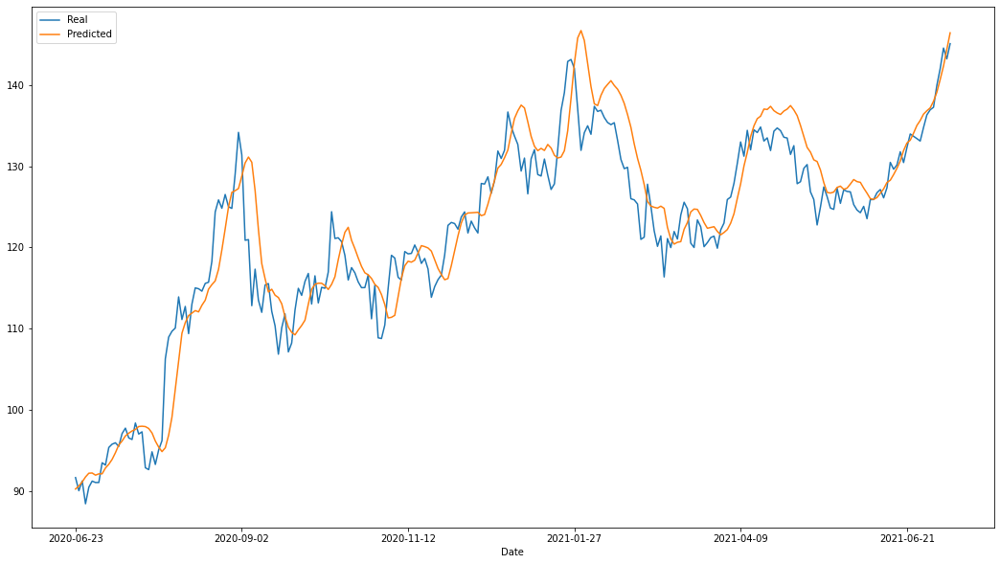
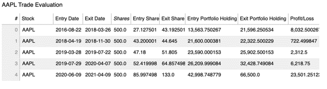

## Project Beta - Using Machine Learning models like Tensorflow Keras LSTM and Pyflux Beta-t-EGARCH to predict the best time to buy Apple Stock over a period of time.

---
By Andre Bacellar, Cristina Pitu, Lucca Tatoni, Lucas Shaiman, and Serra Battal.
---
# Agenda:
- The Data
- Our Models (Tensorflow LSTM and Pyflux Beta-t-EGARCH)
- Our Signals, Entry Points, and Exit Points
- How it works and how trades are executed
- Results of Back Tested Data and Real Time Performance
- Conclusion
# The Data
#### Our models learned from several different stocks, ETFs,  relevant events such as iphone launches, and earnings results as well as SMAs, EMAs, MACD, Bollinger Bands, and trade volume.
Our stocks and ETF’s included the following:
Stock | Ticker
----- | -----
Apple | AAPL
S&P 500 | SPY
Google | GOOG
Nvidia | NVDA
Microsoft | MSFT
Paypal | PYPL
Amazon | AMZN
Netflix | NFLX
Sony | SONY
Dell | DELL
Hewlett-Packard | HPQ
Taiwan Semiconductor | TSM
International Business Machines | IBM
Vanguard Information Technology ETF | VGT
---
Here is how our stocks was correlated.
Correlation Matrix:

Out of our free resources at hand we were able to use 3 full years worth of good data in order to train our LSTM model. With unlimited resources we’d like to have 10+ years to have a more robust model.
# Our Models LSTM & Beta-t-EGARCH

### __PyFlux library change__
PyFlux’s last update was in 2018, thus it is not up to date with the most current Python lingo.
To update it, it was needed to change one file of the library (data_check.py), substituting ‘ix’ for ‘iloc’.
In order to update the file on your end, please follow the steps below:
- Locate where your Python Libraries are stored. For that, you can use the command `python3 -c ‘import sysconfig; print(sysconfig.get_paths()[“purelib”])’`
- Navigate to the PyFlux folder and either paste the data_check.py file that is uploaded in the GitHub repo or open the py file and make the change mentioned above (substitute ix for iloc).*

## Tensorflow LSTM
- Our LSTM had a very common problem that many run into trying to predict the stock market, not enough data.
- LSTM models are great for our autoregressive or random data that doesn’t have any rhyme or reason to it however, it tries its best to find patterns.
- Due to our insufficient data and model parameters, we expereinced a lot of overfitting and various offsets from our predicted and real values.

>[StackOverflow](https://stackoverflow.com/questions/54368686/lstm-having-a-systematic-offset-between-predictions-and-ground-truth)
>[TensorFlow - LSTM](https://www.tensorflow.org/api_docs/python/tf/keras/layers/LSTM)
## PyFlux Beta-t-EGARCH
- PyFlux’s models have been abandoned since 2017 however we wanted to try to use something not touched on in class to see if it would yield us anything interesting.

- Beta-t-EGARCH focuses primarily on stabilizing volatility.

- Using Beta-t-EGARCH helps us identify outliers and not react sharply to large swings and random events - which will be helpful for automating in the future.

>[PyFlux - Beta-t-EGARCH](https://pyflux.readthedocs.io/en/latest/egarch.html#:~:text=Beta%2Dt%2DEGARCH%20models%20were,of%20the%20t%2Ddistribution%20score.)
---
# The Signals - How signals are generated

# How it works and how trades are executed
1. Cloud API running model sends signal
2. Alpaca Trade API receives signal
    * Trade is fullfilled
    * Trade us confirmed
3. Trade is documented and profit/loss is measured
---
# Results of Back Tested Data and Real Time Performance

---
# Conclusion

---
# Additional Sources
> https://pyflux.readthedocs.io/en/latest/egarch.html

> https://towardsdatascience.com/time-series-forecasting-with-2d-convolutions-4f1a0f33dff6

> https://deepdatascience.wordpress.com/2016/11/18/which-lstm-optimizer-to-use/

> https://towardsdatascience.com/metrics-to-evaluate-your-machine-learning-algorithm-f10ba6e38234

> https://pypi.org/project/yfinance/

> https://core.ac.uk/download/pdf/42337476.pdf
